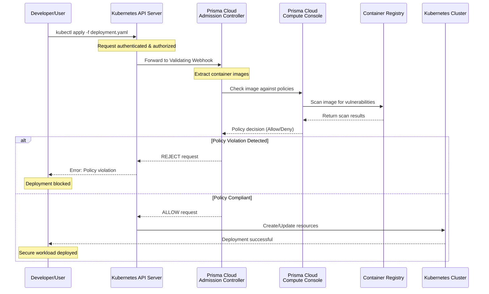
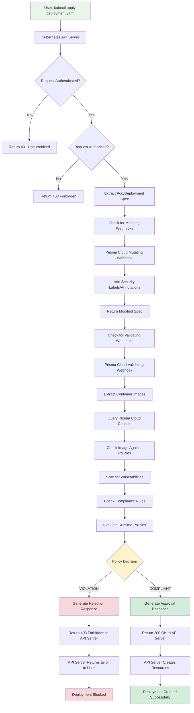

# Prisma Cloud Admission Controller Summary

## Overview

The Prisma Cloud Admission Controller is a Kubernetes admission controller that provides security policy enforcement at the cluster level. It integrates with Prisma Cloud Compute Edition to enforce security policies before workloads are deployed to the cluster, preventing vulnerable or non-compliant containers from running.

## How It Works - Architecture Flow



## Component Architecture

## Request Flow - What Happens When a User Sends a Request




## Open Policy Agent (OPA) Integration

The Prisma Cloud Admission Controller leverages **Open Policy Agent (OPA)** as a policy engine for making admission decisions. OPA provides a unified framework for policy enforcement across different systems and platforms.

### OPA in Prisma Cloud Admission Controller

Based on the [Prisma Cloud Compute Edition documentation](https://docs.prismacloud.io/en/compute-edition/34/admin-guide/access-control/open-policy-agent), OPA integration provides:

#### Key Features:
- **Policy as Code**: Define security policies using Rego language
- **Unified Policy Engine**: Consistent policy evaluation across Prisma Cloud
- **Flexible Rule Engine**: Support for complex policy logic and conditions
- **Integration with Prisma Cloud**: Seamless integration with Prisma Cloud console

#### How OPA Works in Admission Controller:
1. **Policy Definition**: Policies are defined in Rego language and stored in Prisma Cloud
2. **Policy Evaluation**: OPA evaluates incoming requests against defined policies
3. **Decision Making**: OPA returns allow/deny decisions based on policy compliance
4. **Policy Updates**: Policies can be updated dynamically without restarting the controller

#### OPA Policy Examples:
```rego
# Example: Block images with high severity vulnerabilities
package prisma.admission

import rego.v1

deny[msg] {
    input.kind == "Pod"
    some container in input.spec.containers
    container.image == "nginx:1.14"  # Known vulnerable version
    msg := "Image nginx:1.14 has critical vulnerabilities"
}

# Example: Enforce resource limits
deny[msg] {
    input.kind == "Pod"
    some container in input.spec.containers
    not container.resources.limits.memory
    msg := "Container must have memory limits defined"
}
```

#### OPA Integration Benefits:
- **Declarative Policies**: Define what should be allowed/denied, not how to implement it
- **Policy Testing**: Test policies independently of the admission controller
- **Policy Reuse**: Share policies across different Prisma Cloud components
- **Audit Trail**: Complete audit trail of policy decisions and reasoning

## What is an Admission Controller?

Based on the [Kubernetes documentation](https://kubernetes.io/docs/reference/access-authn-authz/admission-controllers/), admission controllers are plugins that govern and enforce how the API is used. They can be validating, mutating, or both, and they intercept requests to the Kubernetes API server before the object is persisted but after the request is authenticated and authorized.

### Key Characteristics:
- **Validating Controllers**: Can reject requests but cannot modify objects
- **Mutating Controllers**: Can modify objects to enforce defaults or mutate requests
- **Execution Order**: Mutating controllers run first, followed by validating controllers
- **Webhook Support**: Can be implemented as webhooks for external validation

## Prisma Cloud Admission Controller Features

### Core Capabilities
1. **Image Vulnerability Scanning**: Scans container images for known vulnerabilities before deployment
2. **Policy Enforcement**: Enforces Prisma Cloud security policies at the cluster level
3. **Compliance Checking**: Validates workloads against compliance standards
4. **Runtime Security**: Prevents deployment of containers with security risks
5. **Integration with Prisma Cloud**: Seamlessly integrates with Prisma Cloud Compute Edition console

### Security Benefits
- **Preventive Security**: Stops vulnerable containers before they reach production
- **Policy Compliance**: Ensures all deployments meet organizational security standards
- **Centralized Management**: Provides centralized policy management through Prisma Cloud console
- **Real-time Enforcement**: Immediate policy enforcement without manual intervention

## Prerequisites

### System Requirements
1. **Kubernetes Cluster**: 
   - Kubernetes version 1.16 or higher
   - Cluster admin privileges for installation
   - Valid kubeconfig file with cluster access

2. **Prisma Cloud Compute Edition**:
   - Prisma Cloud Compute Edition console deployed and accessible
   - Valid Prisma Cloud credentials
   - Network connectivity between Kubernetes cluster and Prisma Cloud console

3. **Cluster Permissions**:
   - Cluster admin role or equivalent permissions
   - Ability to create namespaces, service accounts, and cluster roles
   - Permission to install admission webhooks

### Network Requirements
- **Outbound HTTPS**: Kubernetes cluster must be able to reach Prisma Cloud console
- **Inbound HTTPS**: Prisma Cloud console must be reachable from Kubernetes cluster
- **DNS Resolution**: Proper DNS configuration for Prisma Cloud console

### Storage Requirements
- **Persistent Storage**: For admission controller logs and configuration
- **Temporary Storage**: For image scanning operations

## Deployment Process

### Step 1: Prerequisites Verification
1. **Verify Kubernetes Version**:
   ```bash
   kubectl version --short
   ```

2. **Check Cluster Permissions**:
   ```bash
   kubectl auth can-i create validatingwebhookconfigurations
   kubectl auth can-i create mutatingwebhookconfigurations
   ```

3. **Verify Prisma Cloud Connectivity**:
   ```bash
   curl -k https://<prisma-cloud-console-url>/api/v1/status
   ```

### Step 2: Install Prisma Cloud Admission Controller

1. **Create Namespace**:
   ```bash
   kubectl create namespace prisma-cloud-admission-controller
   ```

2. **Create Service Account**:
   ```bash
   kubectl create serviceaccount prisma-cloud-admission-controller \
     --namespace prisma-cloud-admission-controller
   ```

3. **Create Cluster Role**:
   ```yaml
   apiVersion: rbac.authorization.k8s.io/v1
   kind: ClusterRole
   metadata:
     name: prisma-cloud-admission-controller
   rules:
   - apiGroups: [""]
     resources: ["pods", "services", "endpoints", "persistentvolumeclaims", "events", "configmaps", "secrets"]
     verbs: ["get", "list", "watch", "create", "update", "patch", "delete"]
   - apiGroups: ["apps"]
     resources: ["deployments", "daemonsets", "replicasets", "statefulsets"]
     verbs: ["get", "list", "watch", "create", "update", "patch", "delete"]
   - apiGroups: ["extensions"]
     resources: ["deployments", "replicasets"]
     verbs: ["get", "list", "watch", "create", "update", "patch", "delete"]
   ```

4. **Create Cluster Role Binding**:
   ```yaml
   apiVersion: rbac.authorization.k8s.io/v1
   kind: ClusterRoleBinding
   metadata:
     name: prisma-cloud-admission-controller
   roleRef:
     apiGroup: rbac.authorization.k8s.io
     kind: ClusterRole
     name: prisma-cloud-admission-controller
   subjects:
   - kind: ServiceAccount
     name: prisma-cloud-admission-controller
     namespace: prisma-cloud-admission-controller
   ```

### Step 3: Deploy Admission Controller

1. **Create Deployment**:
   ```yaml
   apiVersion: apps/v1
   kind: Deployment
   metadata:
     name: prisma-cloud-admission-controller
     namespace: prisma-cloud-admission-controller
   spec:
     replicas: 2
     selector:
       matchLabels:
         app: prisma-cloud-admission-controller
     template:
       metadata:
         labels:
           app: prisma-cloud-admission-controller
       spec:
         serviceAccountName: prisma-cloud-admission-controller
         containers:
         - name: admission-controller
           image: prismacloud/admission-controller:latest
           ports:
           - containerPort: 8443
           env:
           - name: PRISMA_CLOUD_CONSOLE_URL
             value: "https://<prisma-cloud-console-url>"
           - name: PRISMA_CLOUD_USERNAME
             value: "<username>"
           - name: PRISMA_CLOUD_PASSWORD
             value: "<password>"
           - name: TLS_CERT_FILE
             value: "/etc/certs/tls.crt"
           - name: TLS_PRIVATE_KEY_FILE
             value: "/etc/certs/tls.key"
           volumeMounts:
           - name: certs
             mountPath: /etc/certs
             readOnly: true
         volumes:
         - name: certs
           secret:
             secretName: prisma-cloud-admission-controller-tls
   ```

2. **Create Service**:
   ```yaml
   apiVersion: v1
   kind: Service
   metadata:
     name: prisma-cloud-admission-controller
     namespace: prisma-cloud-admission-controller
   spec:
     selector:
       app: prisma-cloud-admission-controller
     ports:
     - port: 443
       targetPort: 8443
   ```

### Step 4: Configure Admission Webhooks

1. **Create Validating Webhook Configuration**:
   ```yaml
   apiVersion: admissionregistration.k8s.io/v1
   kind: ValidatingAdmissionWebhook
   metadata:
     name: prisma-cloud-admission-controller
   webhooks:
   - name: prisma-cloud-admission-controller.prisma-cloud.com
     clientConfig:
       service:
         name: prisma-cloud-admission-controller
         namespace: prisma-cloud-admission-controller
         path: "/validate"
       caBundle: <base64-encoded-ca-cert>
     rules:
     - operations: ["CREATE", "UPDATE"]
       apiGroups: [""]
       apiVersions: ["v1"]
       resources: ["pods"]
     - operations: ["CREATE", "UPDATE"]
       apiGroups: ["apps"]
       apiVersions: ["v1"]
       resources: ["deployments", "daemonsets", "replicasets", "statefulsets"]
     failurePolicy: Fail
     admissionReviewVersions: ["v1", "v1beta1"]
   ```

2. **Create Mutating Webhook Configuration**:
   ```yaml
   apiVersion: admissionregistration.k8s.io/v1
   kind: MutatingAdmissionWebhook
   metadata:
     name: prisma-cloud-admission-controller
   webhooks:
   - name: prisma-cloud-admission-controller.prisma-cloud.com
     clientConfig:
       service:
         name: prisma-cloud-admission-controller
         namespace: prisma-cloud-admission-controller
         path: "/mutate"
       caBundle: <base64-encoded-ca-cert>
     rules:
     - operations: ["CREATE", "UPDATE"]
       apiGroups: [""]
       apiVersions: ["v1"]
       resources: ["pods"]
     - operations: ["CREATE", "UPDATE"]
       apiGroups: ["apps"]
       apiVersions: ["v1"]
       resources: ["deployments", "daemonsets", "replicasets", "statefulsets"]
     failurePolicy: Fail
     admissionReviewVersions: ["v1", "v1beta1"]
   ```

## Enablement Process

### Step 1: Verify Installation
1. **Check Pod Status**:
   ```bash
   kubectl get pods -n prisma-cloud-admission-controller
   ```

2. **Verify Webhook Registration**:
   ```bash
   kubectl get validatingwebhookconfigurations
   kubectl get mutatingwebhookconfigurations
   ```

3. **Check Logs**:
   ```bash
   kubectl logs -n prisma-cloud-admission-controller \
     deployment/prisma-cloud-admission-controller
   ```

### Step 2: Test Admission Controller
1. **Deploy Test Pod**:
   ```yaml
   apiVersion: v1
   kind: Pod
   metadata:
     name: test-pod
   spec:
     containers:
     - name: test-container
       image: nginx:latest
   ```

2. **Verify Policy Enforcement**:
   ```bash
   kubectl get events --sort-by=.metadata.creationTimestamp
   ```

### Step 3: Configure Policies
1. **Access Prisma Cloud Console**
2. **Navigate to Defend > Admission Controller**
3. **Configure Security Policies**:
   - Image vulnerability thresholds
   - Compliance requirements
   - Runtime security policies
   - Custom policy rules

## Configuration Options

### Policy Configuration
- **Vulnerability Thresholds**: Set maximum allowed vulnerability severity
- **Compliance Standards**: Enforce specific compliance frameworks
- **Image Scanning**: Configure image scanning policies
- **Runtime Security**: Set runtime protection policies

### Webhook Configuration
- **Failure Policy**: Configure behavior when webhook is unavailable
- **Timeout Settings**: Set webhook timeout values
- **Retry Logic**: Configure retry attempts for failed requests

### Logging and Monitoring
- **Log Level**: Configure logging verbosity
- **Metrics Collection**: Enable metrics for monitoring
- **Alert Configuration**: Set up alerts for policy violations

## Troubleshooting

### Common Issues
1. **Webhook Registration Failures**:
   - Verify TLS certificates
   - Check network connectivity
   - Validate RBAC permissions

2. **Policy Enforcement Issues**:
   - Check Prisma Cloud console connectivity
   - Verify policy configuration
   - Review admission controller logs

3. **Performance Issues**:
   - Monitor webhook response times
   - Check resource utilization
   - Optimize policy rules

### Debugging Steps
1. **Enable Debug Logging**:
   ```bash
   kubectl set env deployment/prisma-cloud-admission-controller \
     LOG_LEVEL=debug -n prisma-cloud-admission-controller
   ```

2. **Check Webhook Status**:
   ```bash
   kubectl describe validatingwebhookconfigurations \
     prisma-cloud-admission-controller
   ```

3. **Review Events**:
   ```bash
   kubectl get events --sort-by=.metadata.creationTimestamp \
     --field-selector involvedObject.name=test-pod
   ```

## Best Practices

### Security
- Use TLS certificates for webhook communication
- Implement proper RBAC permissions
- Regularly update admission controller images
- Monitor webhook performance and availability

### Operations
- Deploy multiple replicas for high availability
- Implement proper resource limits and requests
- Use persistent storage for logs and configuration
- Set up monitoring and alerting

### Policy Management
- Start with permissive policies and gradually tighten
- Test policies in non-production environments first
- Document policy changes and their impact
- Regularly review and update policies

## Integration with Prisma Cloud

### Console Integration
- **Policy Management**: Configure policies through Prisma Cloud console
- **Monitoring**: View admission controller metrics and logs
- **Reporting**: Generate reports on policy violations and compliance

### API Integration
- **Policy Updates**: Automatically sync policy changes
- **Event Streaming**: Stream admission events to Prisma Cloud
- **Compliance Reporting**: Send compliance data to Prisma Cloud

## Conclusion

The Prisma Cloud Admission Controller provides essential security enforcement at the Kubernetes cluster level, preventing vulnerable or non-compliant workloads from being deployed. By integrating with Prisma Cloud Compute Edition, it offers centralized policy management and comprehensive security coverage for containerized workloads.

Key benefits include:
- **Preventive Security**: Stops security issues before deployment
- **Policy Compliance**: Ensures organizational security standards
- **Centralized Management**: Unified policy management through Prisma Cloud
- **Real-time Enforcement**: Immediate policy enforcement without delays

Proper deployment and configuration of the admission controller is crucial for maintaining cluster security and compliance with organizational policies.

## References

- [Prisma Cloud Compute Edition Documentation](https://docs.prismacloud.io/en/compute-edition/34/admin-guide/access-control/open-policy-agent)
- [Kubernetes Admission Controllers Documentation](https://kubernetes.io/docs/reference/access-authn-authz/admission-controllers/)
- [Kubernetes Webhook Admission Controllers](https://kubernetes.io/docs/reference/access-authn-authz/extensible-admission-controllers/)
